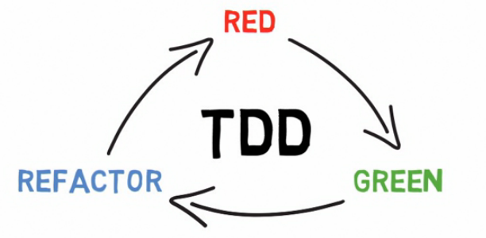

# Test-driven development
* [ ] Examples from [Unit Testing and Test Driven Development in Python] by [Richard Wells]

## Table of contents
* [Levels of testing](#levels-of-testing)
* [Unit Testing](#unit-testing)
* [Test-driven development](#test-driven-development)
* [Python virtual environments](#python-virtual-environments)
* [pytest library](#pytest-library)

## Levels of testing
(safety nets)
- Unit Testing - testing at the function level
- Component Testing - testing at the library and compiled binary level
- System Testing - tests the external interfaces of a system which is a collection of sub-systems
- Performance Testing - testing done at sub-system and system levels to verify timing and resource usages are acceptable

## Unit Testing
### Why do we unit test?
- software bugs can hurt the business
- software testing catches bugs before they get to the field
- need several levels of safety nets

### Unit Testing specifics
- tests individual functions
- a test should be written for each test case for a function (all positive and negative test cases)
- groups of test can be combined into test suites for better organization
- executes in the development environment rather than the production environment
- execution of the test should be automated

### Summary
- unit tests are the first safety net for catching bugs before the get to the field
- unit test validate test cases for individual functions
- they should build and run in the developer's IDE
- unit tests should run fast

## Test-driven development
### What is TDD?
- a process where the developer takes personal responsibility for the quality of their code
- unit test are written before the production code
- don't write all the test or production code at once
- test and production code are both written together in small bits of functionality

### Benefits of TDD
- gives you the confidence to change the code (you already have a test)
- gives you immediate feedback
- documents what the code is doing (knowledge comes from reading a test)
- drives good object oriented design

### TDD work flow

(source: [Unit Testing and Test Driven Development in Python])

- (RED) write a failing unit test
- (GREEN) write just enough production code to make that test pass
- (REFACTOR) refactor the unit test and the production code to make it clean
- repeat until the feature is complete

### 3 Laws of TDD
- you may not write any production code unitl you have written **a failing** unit test
- you may not write more of a unit test than is sufficient to fail, and not compiling is failing
- you may not write more production code than is sufficient to pass the currently failing unit test

## Python virtual environments
- all Python packages are installed to a single directory on the system
- sometimes different projects use different versions of given library
- virtual environments solve this problem by creating isolated Python environments that can be customized per project

### Python3 - setting up Python virtual environment
1. `mkdir my_new_venv`

2. `python3 -m venv my_new_venv`

3. `source my_new_venv/bin/activate`

### Python2.7 - setting up Python virtual environment
1. `pip install virtualenv`

2. `mkdir my_new_venv`

3. `virtualenv my_new_venv`

4. `source ./my_new_venv/bin/activate`

## pytest library
1. Set up Python virtual environment
2. `pip install pytest`

[Unit Testing and Test Driven Development in Python]: https://www.linkedin.com/learning/unit-testing-and-test-driven-development-in-python
[Richard Wells]: https://www.linkedin.com/learning/instructors/richard-wells
